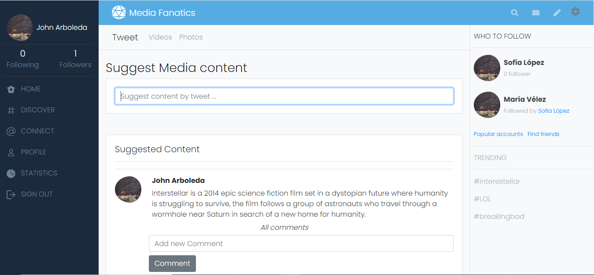
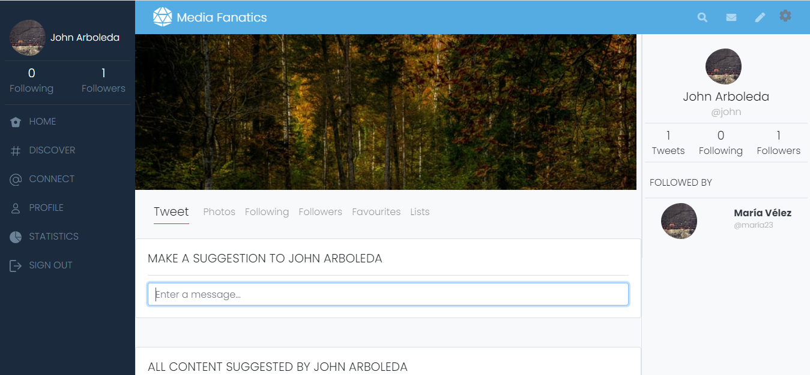

# Twitter Redesign

This is the Capstone Project for the Ruby on Rails module of the Microverse program. A Twitter clone app where users can tweet, comment on those tweets, and follow other users. Click [here](https://www.notion.so/Twitter-redesign-f8a8d48453d54d1a949bb0ceab4c8718) to see the complete guilines of this project.

### Project: Media Fanatics

Media Fanatics is a social network made to share, praise, critique, any kind of media: videos, movies, games. Content created for fans by fans. Check out [this](https://www.loom.com/share/5b53fc8f6b45476d8ba3cf73eed13ba6) brief explanation the project.

**Homepage view**



**Userpage view**



## Built With

- Ruby v2.7.4
- Ruby on Rails v6.1.4
- Bootstrap 4.6

## Live Demo

[Media Fanatics](https://protected-shore-97885.herokuapp.com/)


## Getting Started

To get a local copy up and running follow these simple steps.

### Prerequisites

Ruby: 2.7.4
Rails: 6.1.4
Postgres: >=9.5

### Setup

Install gems with:

```
bundle install
```

Setup database with:

```
   rails db:create
   rails db:migrate
```

### Github Actions

To make sure the linters' checks using Github Actions work properly, you should follow the next steps:

1. On your recently forked repo, enable the GitHub Actions in the Actions tab.
2. Create the `feature/branch` and push.
3. Start working on your milestone as usual.
4. Open a PR from the `feature/branch` when your work is done.


### Usage

Start server with:

```
    rails server
```

Open `http://localhost:3000/` in your browser.

### Run tests

```
    RSpec --format documentation
```

## Authors

**John Arboleda**
- GitHub: [@John-Arboleda](https://github.com/John-Arboleda)
- Twitter: [@John_J_Arboleda](https://twitter.com/John_J_Arboleda)
- LinkedIn: [@john-arboleda](https://www.linkedin.com/in/john-arboleda/)

## 🤝 Contributing

Contributions, issues and feature requests are welcome!

Feel free to check the [issues page](issues/).

## Show your support

Give a ⭐️ if you like this project!

## Acknowledgments

TBA

## 📝 License

This project is [MIT](./LICENSE) licensed.

